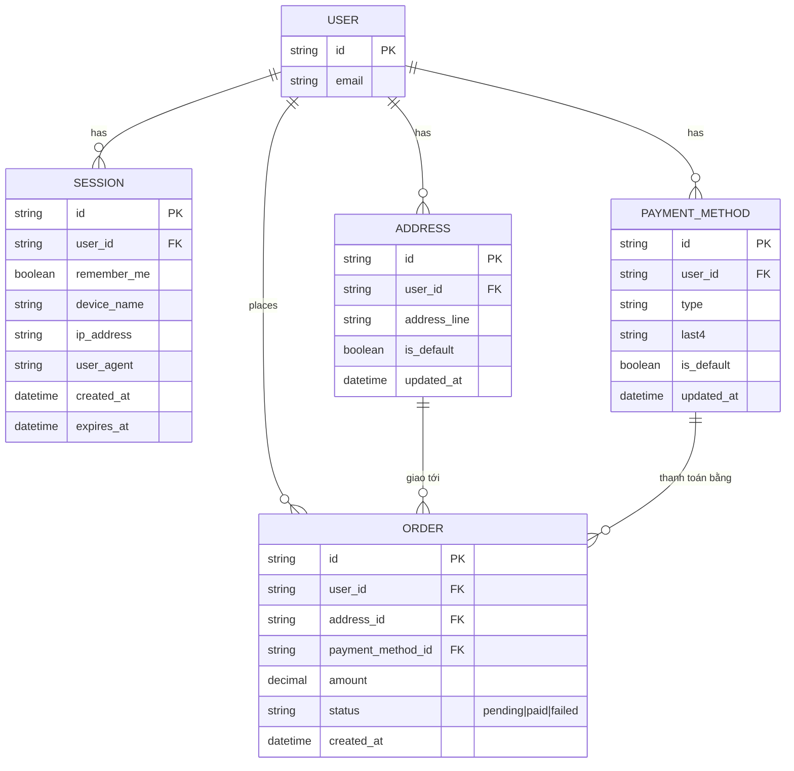

# Base ERD — Marketplace với session "remember me" nhưng chưa tách biệt hành động nhạy cảm

Đây là **base**: trạng thái hệ thống marketplace *trước khi* có theo dõi bất thường và step-up cho hành động nhạy cảm. Suy luận từ đề bài, base đã có `USER` với `SESSION` dạng "remember me" (đăng nhập 1 lần, giữ lâu dài), `ADDRESS` và `PAYMENT_METHOD` được lưu sẵn để mua nhanh, và `ORDER` khi thanh toán. Base coi session còn hạn là đủ điều kiện cho mọi hành động — kể cả đổi địa chỉ, đổi phương thức thanh toán, hay thanh toán — không có bước xác thực bổ sung nào, cũng chưa theo dõi tín hiệu bất thường trong phiên.

