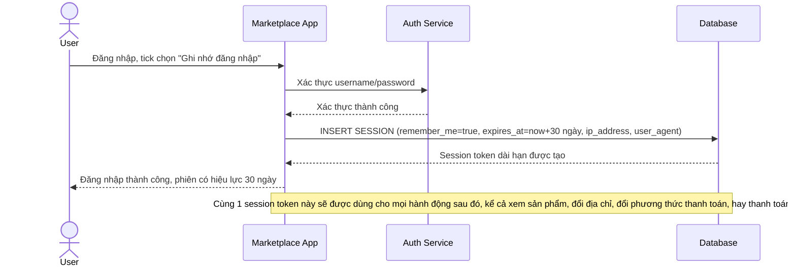

# Base sequence — Login remember me (session dài hạn, không phân biệt hành động sau này)

Đây là **base**, flow đăng nhập với tuỳ chọn "remember me" ở trạng thái hiện tại: sau khi xác thực, hệ thống cấp 1 session dài hạn (vd 30 ngày), session này được dùng cho mọi hành động sau đó mà không phân biệt mức độ nhạy cảm. Đây là nền để so sánh với yêu cầu 1 của đề bài (cần tách biệt session dài hạn khỏi các hành động nhạy cảm).

