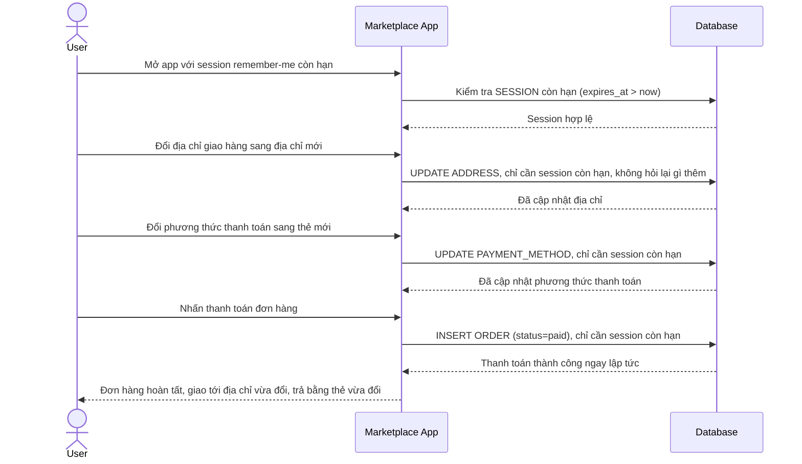

# Base sequence — Checkout (đổi địa chỉ, đổi phương thức thanh toán, thanh toán đều chỉ cần session còn hạn)

Đây là **base**, flow thanh toán ở trạng thái hiện tại: chỉ cần session "remember me" còn hạn là đủ để đổi địa chỉ giao hàng, đổi phương thức thanh toán, và hoàn tất thanh toán, không có bước xác thực bổ sung nào dù đây đều là hành động nhạy cảm. Sơ đồ minh hoạ đúng khoảng trống mà yêu cầu 1 và 4 của đề bài nhắm tới: nếu 1 session bị chiếm quyền, kẻ tấn công có thể đổi địa chỉ nhận hàng rồi thanh toán ngay mà không gặp trở ngại nào.

