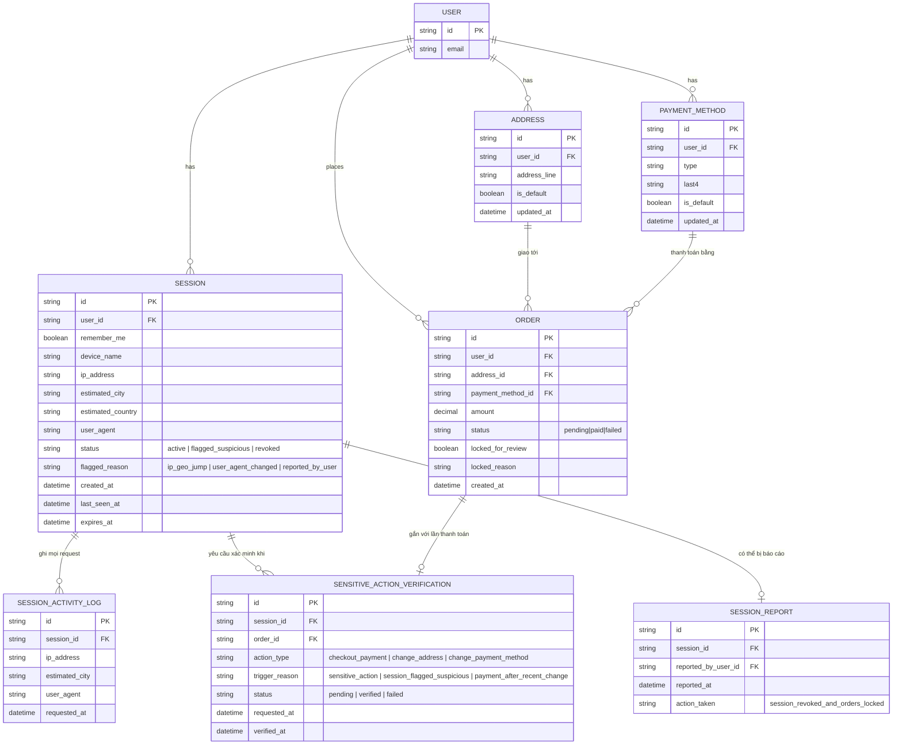

# Enhance ERD — Tách session dài hạn khỏi hành động nhạy cảm, phát hiện bất thường, step-up và báo cáo session

Đây là ERD **sau khi** enhance được áp dụng lên base. So với base, `SESSION` thêm các trường theo dõi rủi ro, và có 3 entity mới, ứng trực tiếp với các yêu cầu:

- `SENSITIVE_ACTION_VERIFICATION` (mới) — mọi hành động nhạy cảm (`checkout_payment`, `change_address`, `change_payment_method`) cần 1 bản ghi xác minh riêng dù `SESSION` còn hạn — đáp ứng yêu cầu 1.
- `SESSION_ACTIVITY_LOG` (mới) cùng `SESSION.status`/`flagged_reason` — ghi lại IP/geo/user-agent theo từng request để phát hiện thay đổi bất hợp lý giữa các request liên tiếp, gắn cờ session nghi ngờ nhưng không đăng xuất ngay nếu chỉ đang xem sản phẩm — đáp ứng yêu cầu 2 và 3.
- `SENSITIVE_ACTION_VERIFICATION.trigger_reason=payment_after_recent_change` cùng `ADDRESS.updated_at`/`PAYMENT_METHOD.updated_at` — phát hiện thanh toán diễn ra ngay sau khi vừa đổi thông tin nhạy cảm, buộc xác minh lại trước khi hoàn tất — đáp ứng yêu cầu 4.
- `SESSION_REPORT` (mới) cùng `ORDER.locked_for_review` — người dùng xem lịch sử session và báo cáo session lạ, hệ thống tự động khoá tạm các giao dịch đang treo của session đó — đáp ứng yêu cầu 5.

