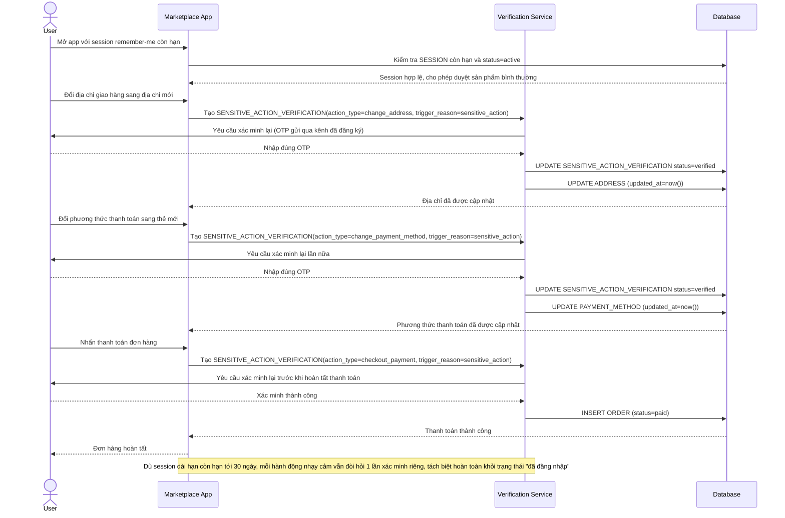

# Enhance sequence — Checkout (hành động nhạy cảm luôn cần xác minh bổ sung dù session còn hạn)

Đây là **enhance** của flow `checkout` đã có ở base. So với base (chỉ cần session còn hạn là đổi địa chỉ/phương thức thanh toán/thanh toán được ngay), nay mỗi hành động nhạy cảm đều tạo 1 `SENSITIVE_ACTION_VERIFICATION` riêng và bắt buộc xác minh lại (vd mã OTP, xác nhận sinh trắc học) trước khi được thực hiện, bất kể session chính vẫn còn hạn. Đáp ứng yêu cầu 1 của đề bài.

