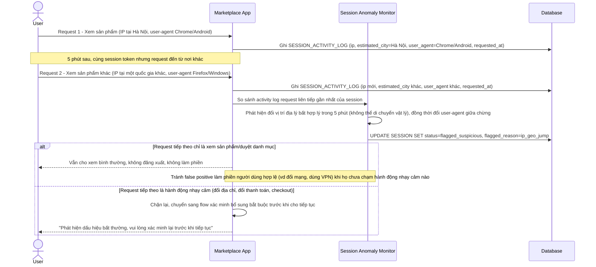

# Enhance sequence — Phát hiện bất thường trong phiên, gắn cờ nghi ngờ mà không đăng xuất ngay

Đây là **enhance**, flow hoàn toàn mới, chưa tồn tại ở base. Mỗi request đều được ghi vào `SESSION_ACTIVITY_LOG` để so sánh IP/vị trí địa lý và user-agent giữa các request liên tiếp, phát hiện dấu hiệu session bị chiếm quyền. Khi bị gắn cờ nghi ngờ, hệ thống chỉ chặn hành động nhạy cảm chứ không đăng xuất người dùng nếu họ chỉ đang xem sản phẩm. Đáp ứng yêu cầu 2 và 3 của đề bài.

