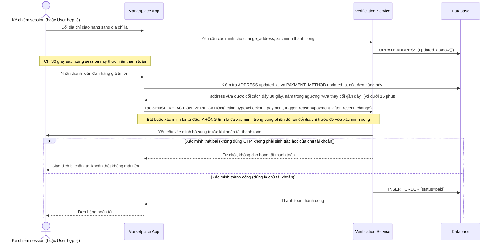

# Enhance sequence — Tự động yêu cầu xác minh lại khi thanh toán ngay sau khi vừa đổi thông tin nhạy cảm

Đây là **enhance**, flow hoàn toàn mới, chưa tồn tại ở base. Ngay cả khi session không bị gắn cờ nghi ngờ và người dùng đã xác minh xong cho lần đổi địa chỉ/phương thức thanh toán trước đó, hệ thống vẫn tự động buộc xác minh lại thêm 1 lần nữa nếu thanh toán diễn ra ngay sau đó, để chặn kịch bản chiếm session rồi đổi địa chỉ nhận hàng rồi thanh toán liền. Đáp ứng yêu cầu 4 của đề bài.

