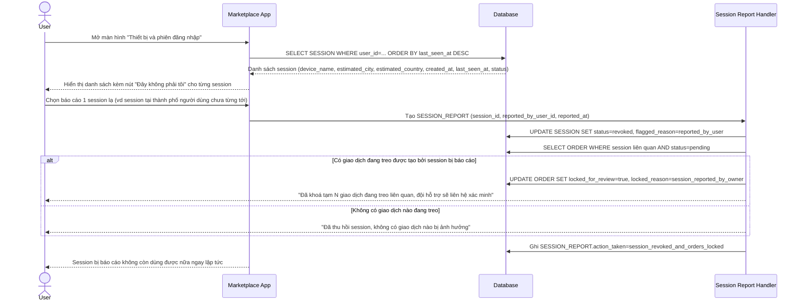

# Enhance sequence — Xem lịch sử session, báo cáo session lạ, tự động khoá giao dịch treo

Đây là **enhance**, flow hoàn toàn mới, chưa tồn tại ở base. Người dùng xem được danh sách session gần đây (thiết bị, vị trí ước lượng, thời gian) và có thể báo cáo session không phải của mình, hệ thống sẽ tự động thu hồi session đó và khoá tạm các giao dịch đang treo liên quan. Đáp ứng yêu cầu 5 của đề bài.

