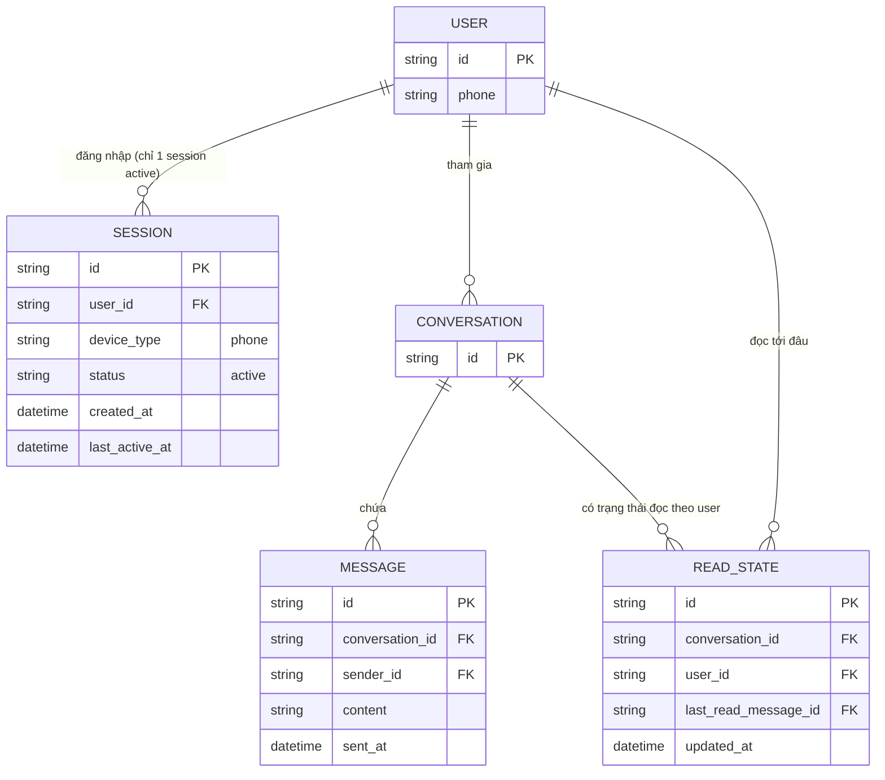

# Base ERD — App tin nhắn chỉ hỗ trợ 1 phiên hoạt động duy nhất

Đây là **base**: trạng thái hệ thống app tin nhắn *trước khi* có tính năng thiết bị liên kết. Suy luận từ đề bài, base đã có `USER`, mỗi user có `CONVERSATION` chứa nhiều `MESSAGE`, và `READ_STATE` lưu tin nhắn cuối cùng đã đọc của user trong từng hội thoại. Về đăng nhập, base chỉ cho phép **1 `SESSION` hoạt động tại một thời điểm** (đăng nhập ở thiết bị mới sẽ tự động đăng xuất thiết bị cũ) — chưa có khái niệm thiết bị chính/thiết bị liên kết, chưa hỗ trợ dùng đồng thời nhiều thiết bị, nên cũng chưa từng gặp vấn đề đồng bộ giữa nhiều session cùng lúc.

