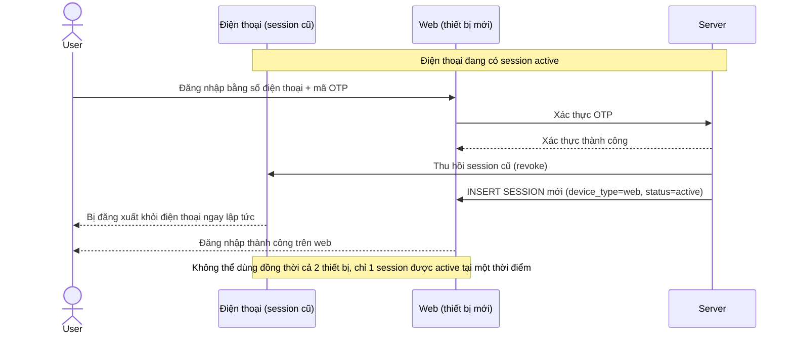

# Base sequence — Login (đăng nhập thiết bị mới sẽ đăng xuất thiết bị cũ)

Đây là **base**, flow đăng nhập ở trạng thái hiện tại: app chỉ cho phép 1 session hoạt động, đăng nhập thành công trên thiết bị mới sẽ tự động đăng xuất session đang hoạt động trên thiết bị cũ. Đây là nền để so sánh với yêu cầu 1 của đề bài — thay vì đăng xuất thiết bị cũ, hệ thống cần cho phép thêm thiết bị liên kết song song với thiết bị chính, nhưng phải qua xác nhận trực tiếp từ thiết bị chính.

