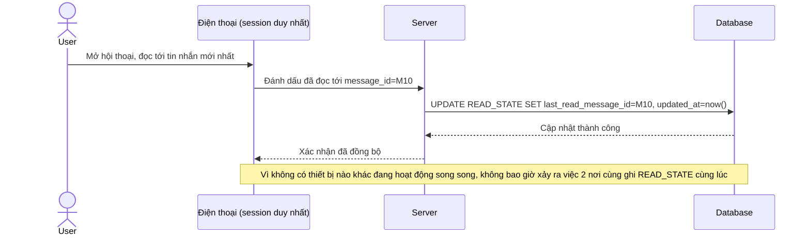

# Base sequence — Mark as read (chỉ 1 session nên không có tranh chấp cập nhật)

Đây là **base**, flow đánh dấu đã đọc ở trạng thái hiện tại: vì chỉ có duy nhất 1 session hoạt động tại một thời điểm, việc cập nhật `READ_STATE` luôn tuần tự, không có tranh chấp ghi đồng thời. Đây là nền để so sánh với yêu cầu 5 của đề bài, vốn chỉ phát sinh khi cho phép nhiều thiết bị liên kết cùng hoạt động song song.

