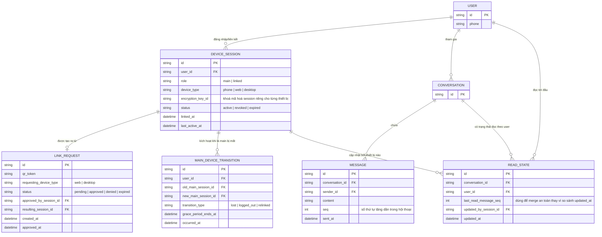

# Enhance ERD — Thiết bị chính + nhiều thiết bị liên kết, khoá riêng, chính sách khi mất thiết bị chính, đồng bộ an toàn

Đây là ERD **sau khi** enhance được áp dụng lên base. So với base (chỉ 1 session, đăng nhập mới đăng xuất session cũ), `SESSION` được đổi tên khái niệm thành `DEVICE_SESSION` với vai trò `main`/`linked`, và có 3 entity mới, ứng trực tiếp với các yêu cầu:

- `LINK_REQUEST` (mới) — thiết bị web/desktop muốn liên kết phải tạo yêu cầu kèm QR token, chỉ trở thành `DEVICE_SESSION` thật sau khi được `approved_by_session_id` (thiết bị chính) quét/duyệt — đáp ứng yêu cầu 1 (không cho liên kết chỉ bằng thông tin đăng nhập từ xa).
- `DEVICE_SESSION.encryption_key_id` — mỗi thiết bị liên kết có khoá mã hoá session riêng, revoke 1 thiết bị chỉ xoá đúng khoá và session đó — đáp ứng yêu cầu 2 và 3 (revoke từng thiết bị riêng lẻ, xem được `linked_at`/`last_active_at` của từng thiết bị).
- `MAIN_DEVICE_TRANSITION` (mới) — khi thiết bị chính mất/đăng xuất, ghi lại `grace_period_ends_at` cho các thiết bị liên kết đang hoạt động — đáp ứng yêu cầu 4.
- `READ_STATE.last_read_message_seq` (số thứ tự tăng dần, thay cho so sánh theo `updated_at`) cùng `updated_by_session_id` — cho phép merge an toàn khi nhiều thiết bị liên kết cùng đánh dấu đã đọc gần như đồng thời — đáp ứng yêu cầu 5.

