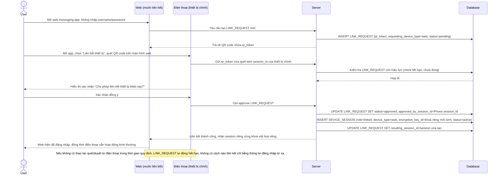

# Enhance sequence — Liên kết thiết bị mới qua QR code, phải duyệt từ thiết bị chính

Đây là **enhance**, flow hoàn toàn mới thay thế cho việc "đăng nhập thiết bị mới sẽ đăng xuất thiết bị cũ" ở base. Thiết bị web/desktop muốn liên kết phải hiển thị QR code, và chỉ trở thành thiết bị liên kết thật sự sau khi thiết bị chính quét và xác nhận — không cho phép liên kết chỉ bằng cách nhập lại thông tin đăng nhập từ xa. Đáp ứng yêu cầu 1 của đề bài.

