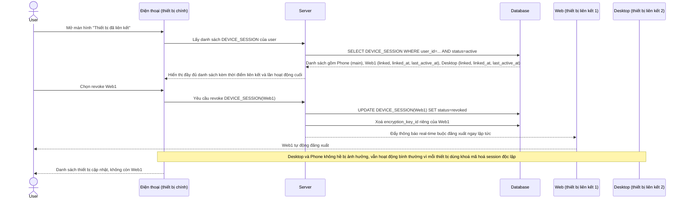

# Enhance sequence — Xem danh sách thiết bị liên kết, revoke từng thiết bị riêng lẻ

Đây là **enhance**, flow hoàn toàn mới, chưa tồn tại ở base (base không có khái niệm nhiều thiết bị để quản lý). Người dùng xem đầy đủ danh sách thiết bị liên kết đang hoạt động ngay trên thiết bị chính, và revoke được từng thiết bị riêng lẻ ngay lập tức mà không ảnh hưởng tới thiết bị chính hay các thiết bị liên kết khác, nhờ mỗi thiết bị có khoá mã hoá session riêng. Đáp ứng yêu cầu 2 và 3 của đề bài.

