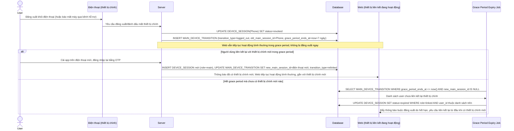

# Enhance sequence — Chính sách khi thiết bị chính bị mất/đăng xuất

Đây là **enhance**, flow hoàn toàn mới, chưa tồn tại ở base. Khi thiết bị chính (điện thoại) đăng xuất hoặc bị đánh dấu mất, các thiết bị liên kết đang hoạt động không bị thu hồi ngay lập tức mà có 1 khoảng grace period để người dùng liên kết lại với thiết bị chính mới, sau đó tự động hết hạn nếu không có hành động gì. Đáp ứng yêu cầu 4 của đề bài.

