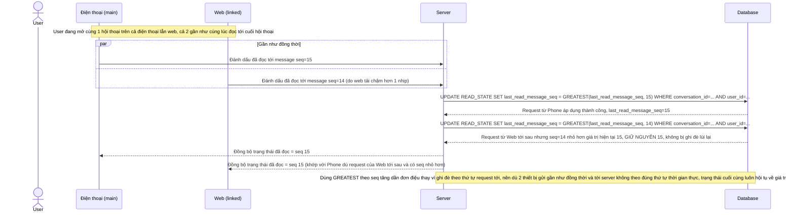

# Enhance sequence — Mark as read (2 thiết bị liên kết cùng thao tác gần như đồng thời)

Đây là **enhance** của flow `mark-as-read` đã có ở base. So với base (chỉ 1 session nên không có tranh chấp), nay nhiều thiết bị liên kết có thể cùng đánh dấu đã đọc gần như đồng thời. Thay vì so sánh `updated_at` (dễ sai lệch do đồng hồ hệ thống khác nhau giữa các thiết bị), hệ thống dùng `last_read_message_seq` tăng dần đơn điệu theo hội thoại và chỉ merge theo giá trị lớn nhất, đảm bảo nhất quán dù request nào tới server trước. Đáp ứng yêu cầu 5 của đề bài.

