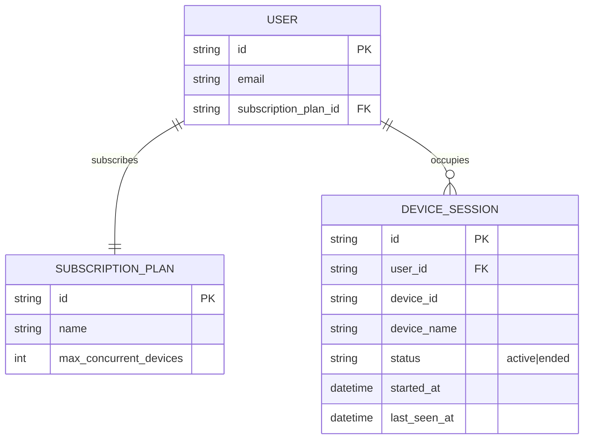

# Base ERD — Quản lý device slot chưa có cơ chế khóa và bảo vệ race condition

Đây là **base**: trạng thái hệ thống streaming *trước khi* áp dụng distributed lock, heartbeat timeout và chính sách chống chia sẻ tài khoản. Suy luận từ đề bài, base đã có `USER` gắn với 1 `SUBSCRIPTION_PLAN` quy định `max_concurrent_devices`, mỗi lần phát video trên 1 thiết bị tạo/tái sử dụng 1 `DEVICE_SESSION` đại diện cho slot đang chiếm. Base chỉ đếm số session đang active bằng một điều kiện đơn giản (đếm số row `status = active`) khi cho phép play, chưa có cơ chế khóa khi nhiều request chiếm slot đồng thời, chưa có heartbeat để phát hiện thiết bị chết, và chưa phân biệt được tín hiệu chia sẻ tài khoản bất thường.

