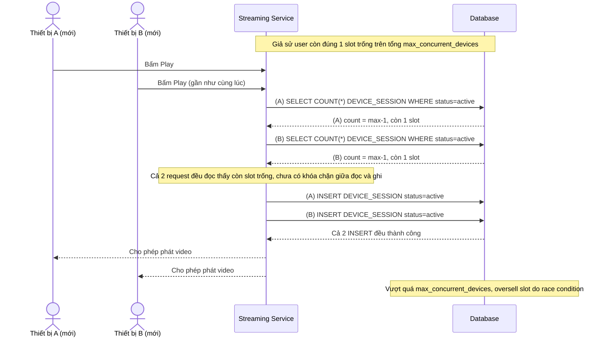

# Base sequence — Acquire slot khi bấm play (race condition chưa xử lý)

Đây là **base**, flow chiếm slot hiện tại: server đếm số `DEVICE_SESSION` đang active rồi so sánh với `max_concurrent_devices` bằng một transaction đọc-rồi-ghi thông thường, không có khóa nào bảo vệ khoảng giữa lúc đếm và lúc ghi. Đây chính là kịch bản race condition nêu ở yêu cầu 1 của đề bài, khi hai thiết bị mới cùng bấm play gần như đồng thời lúc chỉ còn 1 slot trống.

