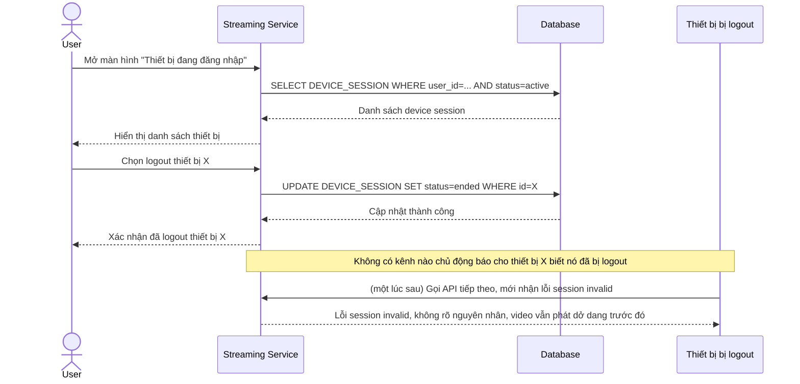

# Base sequence — Xem danh sách thiết bị và force-logout thủ công

Đây là **base**, flow người dùng vào màn hình "Thiết bị đang đăng nhập" để xem danh sách `DEVICE_SESSION` đang active và chủ động logout một thiết bị. Đây là tiền đề cho yêu cầu 5 của đề bài (force-logout phải giải phóng slot gần như ngay lập tức) — ở base, việc release slot chỉ cập nhật DB, thiết bị bị logout không nhận được tín hiệu chủ động nào để dừng phát ngay mà phải tự phát hiện qua lần gọi API tiếp theo.

