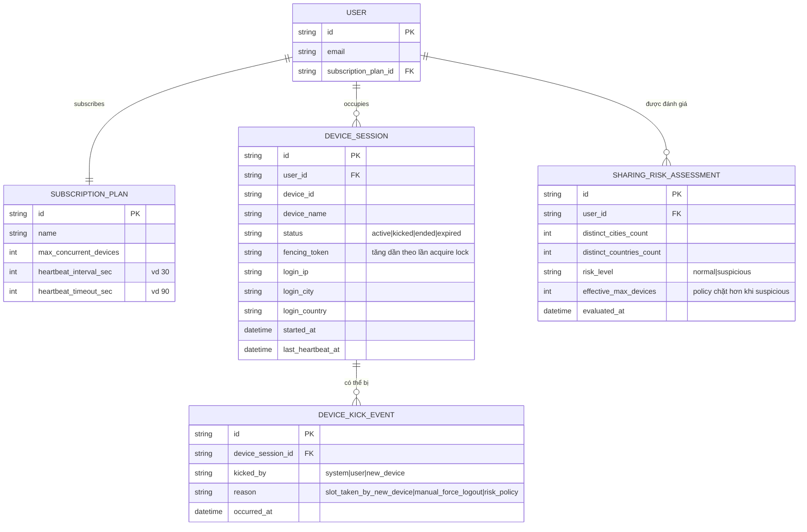

# Enhance ERD — Thêm heartbeat, fencing token, risk detection và kick notification

Đây là ERD **sau khi** enhance được áp dụng lên base. So với base, `DEVICE_SESSION` được bổ sung các trường theo dõi sức khỏe kết nối và định danh địa lý, đồng thời có 2 entity mới, ứng trực tiếp với các yêu cầu:

- `DEVICE_SESSION.fencing_token` — hỗ trợ yêu cầu 1 (distributed lock per-user khi giành slot cuối, dùng token tăng dần để phát hiện ghi trễ sau khi lock đã hết hạn). Bản thân distributed lock là coordination tạm thời trên Redis (key `slot-lock:{user_id}`), không phải entity dữ liệu bền vững nên không xuất hiện trong ERD.
- `DEVICE_SESSION.status` mở rộng thêm giá trị `kicked`, cùng entity mới `DEVICE_KICK_EVENT` — đáp ứng yêu cầu 2 (dừng phát ngay và hiển thị lý do cụ thể trên thiết bị bị đá), đồng thời entity này cũng được tái dùng cho yêu cầu 5 (force-logout thủ công).
- `DEVICE_SESSION.last_heartbeat_at` cùng `SUBSCRIPTION_PLAN.heartbeat_interval_sec`/`heartbeat_timeout_sec` — đáp ứng yêu cầu 3 (xác định thiết bị ngừng hoạt động qua timeout thay vì tín hiệu logout rõ ràng).
- `DEVICE_SESSION.login_ip`/`login_city`/`login_country`, cùng entity mới `SHARING_RISK_ASSESSMENT` — đáp ứng yêu cầu 4 (phát hiện dấu hiệu chia sẻ tài khoản vượt phạm vi qua đa dạng địa lý, áp policy slot chặt hơn khi nghi ngờ).

