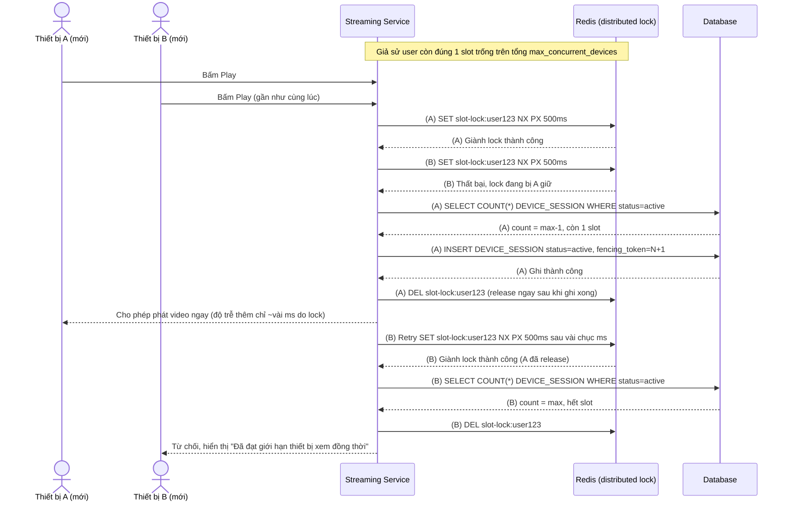

# Enhance sequence — Acquire slot bằng distributed lock, tránh race cho slot cuối

Đây là **enhance** của flow `acquire-slot` đã có ở base. So với base, thay vì đọc-đếm rồi ghi trực tiếp, server phải giành một distributed lock ngắn hạn theo `user_id` trên Redis trước khi đếm và ghi slot, cấp `fencing_token` tăng dần cho mỗi session mới. Đáp ứng yêu cầu 1: đảm bảo hai thiết bị mới cùng giành slot cuối không thể cùng vượt giới hạn, đồng thời lock chỉ bọc phần đếm+ghi rất ngắn (vài ms) nên không làm chậm đáng kể việc bắt đầu phát video.

