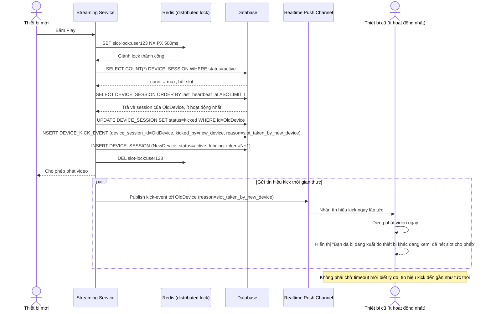

# Enhance sequence — Kick thiết bị cũ khi thiết bị mới giành chỗ lúc đã hết slot

Đây là **enhance**, flow hoàn toàn mới phát sinh khi tài khoản đã dùng hết `max_concurrent_devices` và có thêm một thiết bị mới muốn phát. Đáp ứng yêu cầu 2: thiết bị cũ (được chọn là thiết bị ít hoạt động nhất theo `last_heartbeat_at`) bị đá ra để nhường chỗ, phải dừng phát ngay và hiển thị rõ lý do, không để người dùng gặp lỗi timeout khó hiểu.

