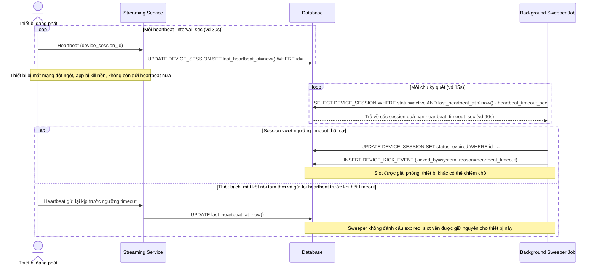

# Enhance sequence — Heartbeat định kỳ và tự động giải phóng slot khi timeout

Đây là **enhance**, flow hoàn toàn mới bổ sung tín hiệu heartbeat từ client và job nền quét session hết hạn. Đáp ứng yêu cầu 3: xác định thiết bị đã ngừng hoạt động (app bị kill nền, mất mạng, đóng tab) qua ngưỡng timeout hợp lý, tránh vừa giữ slot ảo cho thiết bị đã tắt thật sự vừa tránh giải phóng nhầm slot của thiết bị chỉ mất kết nối tạm thời.

