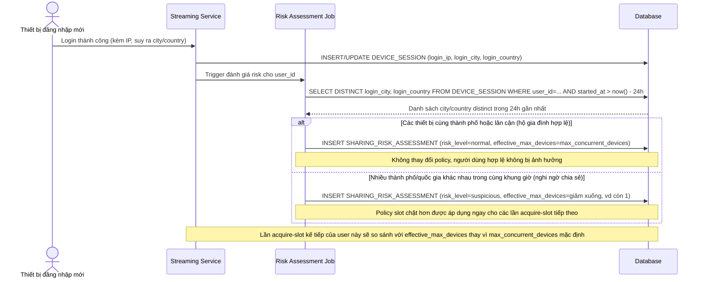

# Enhance sequence — Phát hiện dấu hiệu chia sẻ tài khoản qua đa dạng địa lý

Đây là **enhance**, flow hoàn toàn mới chạy khi có login mới, đánh giá mức độ nghi ngờ chia sẻ tài khoản dựa trên vị trí địa lý các session gần đây. Đáp ứng yêu cầu 4: phân biệt hộ gia đình hợp lệ dùng nhiều thiết bị với dấu hiệu chia sẻ vượt phạm vi (nhiều thành phố/quốc gia khác nhau trong cùng khung giờ), áp policy slot chặt hơn cho trường hợp nghi ngờ mà không cản trở người dùng bình thường.

