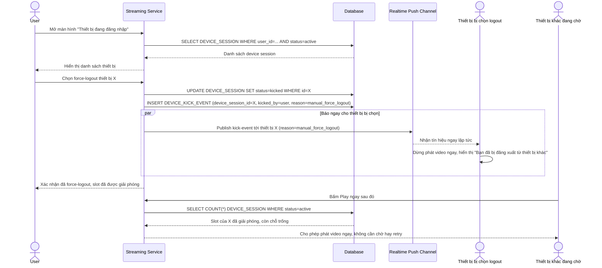

# Enhance sequence — Force-logout thủ công giải phóng slot gần như tức thời

Đây là **enhance** của flow `manage-devices` đã có ở base. So với base (chỉ cập nhật DB rồi để thiết bị bị logout tự phát hiện ở lần gọi API kế tiếp), enhance dùng lại cơ chế push realtime đã xây cho việc kick tự động (xem `6-enhance-kick-device-sqd.md`) để báo ngay cho thiết bị bị chọn. Đáp ứng yêu cầu 5: force-logout phải giải phóng slot gần như ngay lập tức, không để thiết bị khác phải chờ hoặc thử lại nhiều lần.

