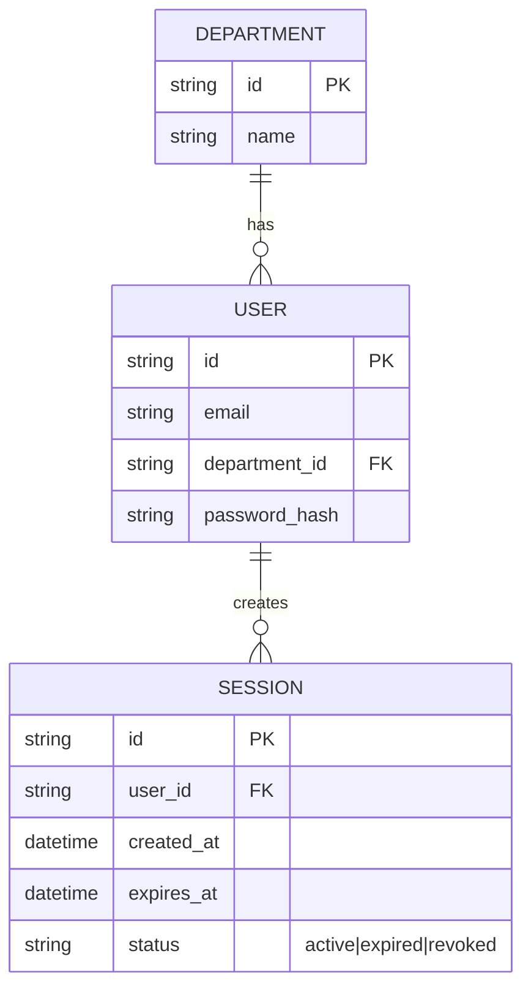

# Base ERD — Đăng nhập chỉ dựa trên mật khẩu, chưa có kiểm tra thiết bị

Đây là **base**: trạng thái công cụ nội bộ *trước khi* áp dụng chính sách Zero Trust dựa trên device posture. Suy luận từ đề bài, base đã có `USER` thuộc về 1 `DEPARTMENT`, đăng nhập thành công tạo 1 `SESSION` chỉ dựa trên việc xác thực đúng mật khẩu (có thể kèm MFA cơ bản), không có khái niệm thiết bị nào được ghi nhận hay kiểm tra — bất kỳ thiết bị nào (công ty quản lý hay cá nhân/BYOD) đăng nhập đúng mật khẩu đều được cấp session như nhau.

