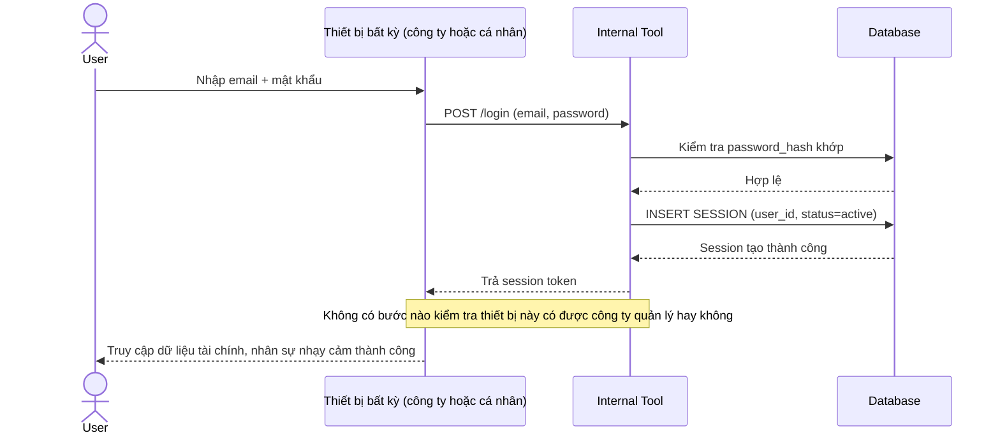

# Base sequence — Login chỉ xác thực mật khẩu, không quan tâm thiết bị

Đây là **base**, flow đăng nhập hiện tại: server chỉ kiểm tra email/mật khẩu đúng là cấp session ngay, không hỏi gì về thiết bị đang dùng để truy cập. Đây là tiền đề để đề bài "có nghĩa" — chính vì base không phân biệt được thiết bị công ty quản lý với thiết bị cá nhân nên mới cần bổ sung device posture verification.

