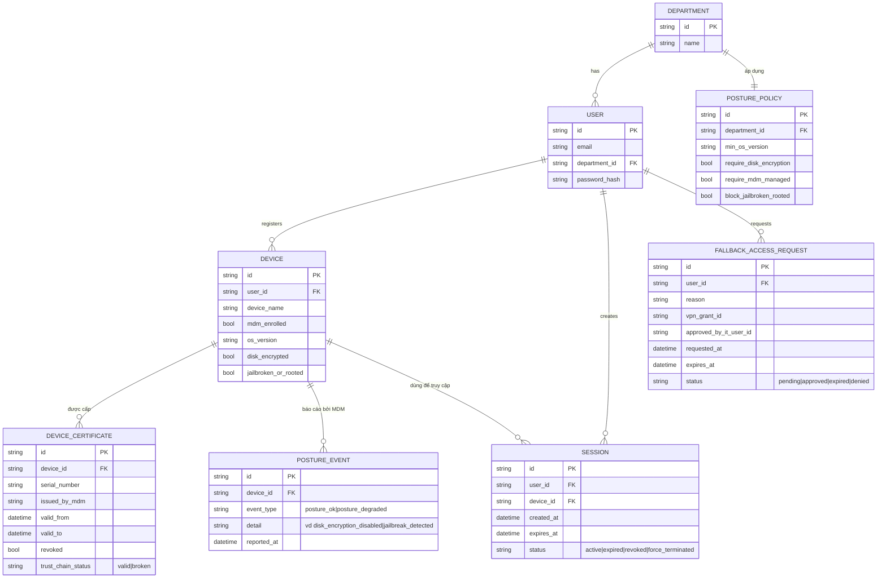

# Enhance ERD — Thêm device certificate, posture policy theo phòng ban và fallback access

Đây là ERD **sau khi** enhance được áp dụng lên base. So với base, `SESSION` giờ gắn với 1 `DEVICE` cụ thể thay vì chỉ gắn với `USER`, và có 4 entity mới, ứng trực tiếp với các yêu cầu:

- `DEVICE` và `DEVICE_CERTIFICATE` (mới) — đáp ứng yêu cầu 1 (request phải kèm certificate do MDM cấp, server verify còn hạn/chưa bị revoke/đúng chuỗi tin cậy trước khi cấp session) và yêu cầu 2 (thiết bị không có certificate hợp lệ, `mdm_enrolled=false`, bị từ chối với lý do rõ ràng).
- `POSTURE_POLICY` (mới), gắn với `DEPARTMENT` thay vì gắn cứng toàn công ty — đáp ứng yêu cầu 4 (chính sách OS tối thiểu, bắt buộc mã hóa... cấu hình được theo từng nhóm người dùng/phòng ban).
- `POSTURE_EVENT` (mới) ghi lại báo cáo posture theo thời gian thực từ MDM, dùng để phát hiện thiết bị chuyển sang không đạt chuẩn — đáp ứng yêu cầu 3 (buộc kết thúc session gần như ngay lập tức khi posture xấu đi).
- `FALLBACK_ACCESS_REQUEST` (mới) — đáp ứng yêu cầu 5 (luồng dự phòng VPN tạm thời + xác minh thủ công bởi IT, có log đầy đủ và giới hạn thời gian).

