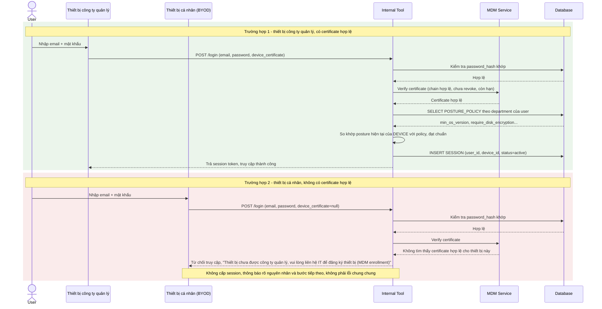

# Enhance sequence — Login yêu cầu verify device certificate trước khi cấp session

Đây là **enhance** của flow `login` đã có ở base. So với base (chỉ kiểm tra mật khẩu), enhance bắt buộc request phải kèm device certificate, server verify certificate hợp lệ trước khi cấp session, và có nhánh từ chối rõ ràng cho thiết bị BYOD không có certificate. Đáp ứng yêu cầu 1 (verify certificate còn hạn, chưa revoke, đúng chuỗi tin cậy) và yêu cầu 2 (từ chối rõ ràng, hướng dẫn liên hệ IT đăng ký thiết bị thay vì lỗi mơ hồ).

