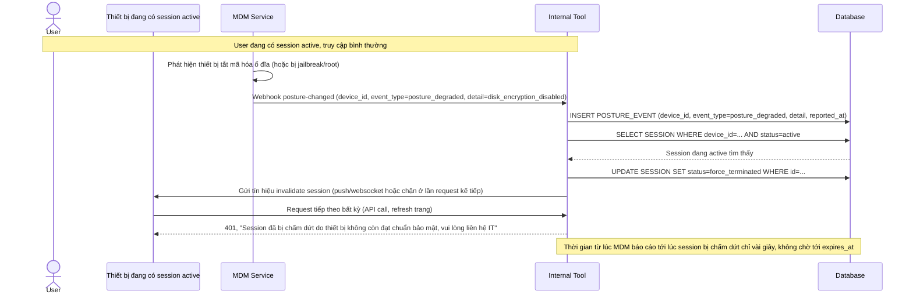

# Enhance sequence — Buộc kết thúc session ngay khi MDM báo posture xấu đi

Đây là **enhance**, flow hoàn toàn mới xử lý sự kiện MDM báo cáo real-time trong lúc session đang hoạt động. Đáp ứng yêu cầu 3: khi thiết bị chuyển sang trạng thái không đạt chuẩn (tắt mã hóa ổ đĩa, jailbreak/root), hệ thống phải buộc kết thúc session hiện tại gần như ngay lập tức, không chờ session tự hết hạn theo `expires_at`.

