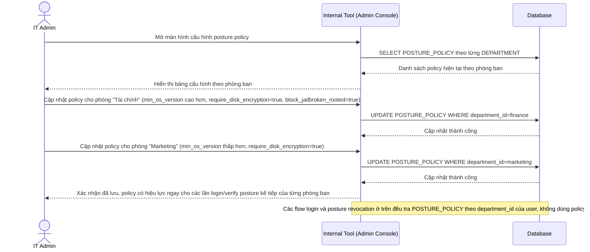

# Enhance sequence — IT admin cấu hình posture policy riêng theo phòng ban

Đây là **enhance**, flow hoàn toàn mới cho phép IT admin định nghĩa và cập nhật `POSTURE_POLICY` theo từng `DEPARTMENT` thay vì dùng một chính sách cứng chung cho toàn công ty. Đáp ứng yêu cầu 4: chính sách posture (phiên bản OS tối thiểu, bắt buộc mã hóa...) phải cấu hình được theo nhóm người dùng/phòng ban khác nhau — ví dụ phòng Tài chính yêu cầu chuẩn khắt khe hơn phòng Marketing.

