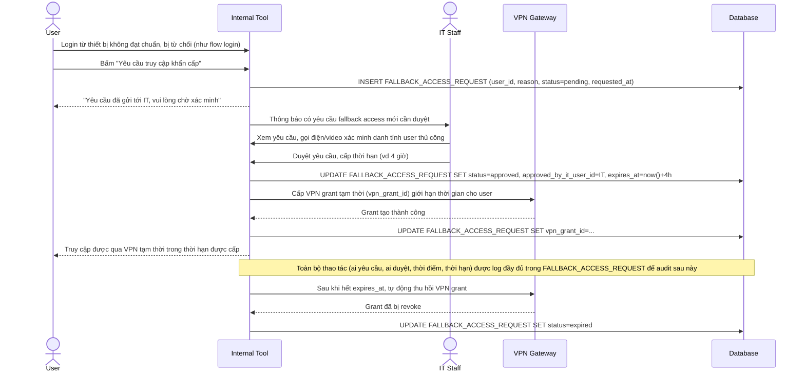

# Enhance sequence — Fallback VPN tạm thời có xác minh thủ công bởi IT

Đây là **enhance**, flow hoàn toàn mới xử lý trường hợp khẩn cấp: nhân viên cần truy cập gấp từ thiết bị không đạt chuẩn posture (hoặc chưa kịp đăng ký MDM). Đáp ứng yêu cầu 5: luồng dự phòng có kiểm soát, được ghi log đầy đủ và giới hạn thời gian, không phải là lối tắt bỏ qua Zero Trust vĩnh viễn.

