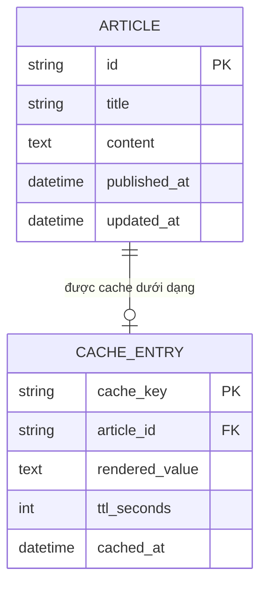

# Base ERD — Cache đơn giản, cache miss là mỗi request tự query DB

Đây là **base**: trạng thái hệ thống cache *trước khi* có leader coordinator chống thundering herd. Suy luận từ đề bài, base đã có `ARTICLE` là dữ liệu gốc trong DB, và một `CACHE_ENTRY` lưu bản render sẵn của article theo cache key (thường là `article:{id}`) với TTL cố định. Khi cache miss (hết hạn hoặc chưa có), base chưa có bất kỳ cơ chế điều phối nào — request nào cũng tự query DB rồi tự ghi lại cache, không ai chờ ai.

