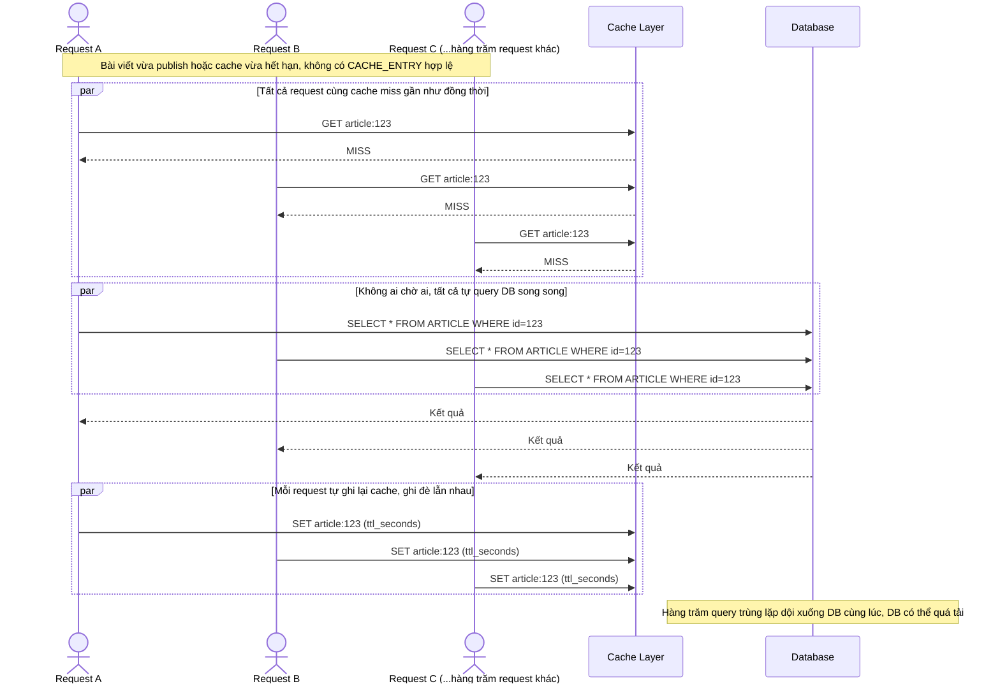

# Base sequence — Cache miss đồng loạt, mọi request tự query DB (thundering herd)

Đây là **base**, flow đọc bài viết hiện tại khi cache miss: mỗi request kiểm tra cache, không thấy hoặc thấy hết hạn thì tự đi query DB rồi tự ghi lại cache, không có điều phối giữa các request. Đây chính là kịch bản thundering herd nêu trong đề bài — sau khi publish bài mới hoặc cache hết hạn, hàng trăm request cùng cache miss và cùng dội xuống DB song song.

