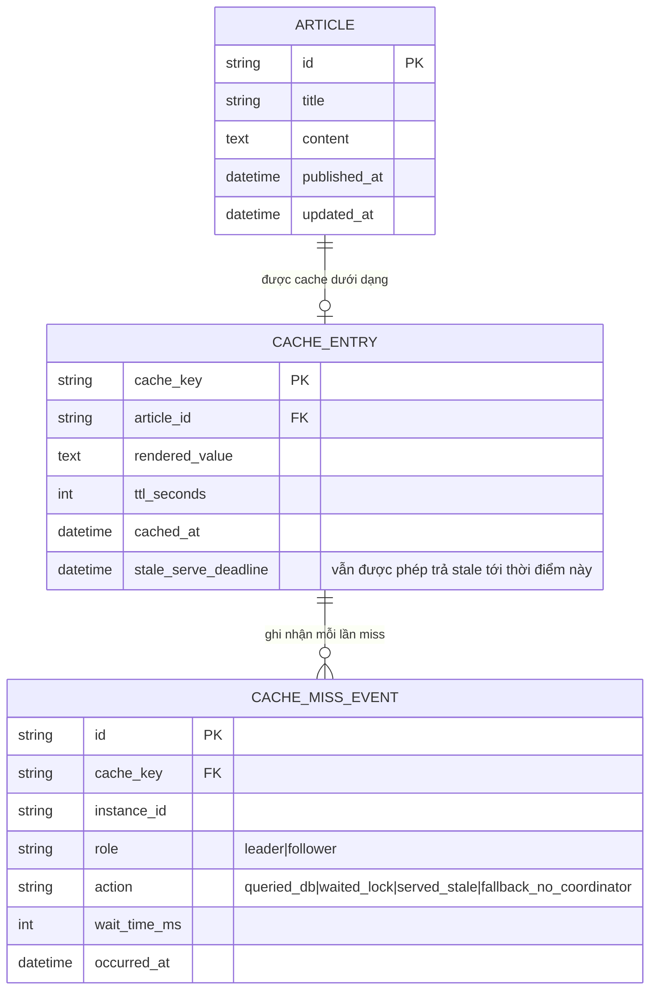

# Enhance ERD — Thêm ghi nhận sự kiện cache miss để đo lường hiệu quả coordinator

Đây là ERD **sau khi** enhance được áp dụng lên base. `ARTICLE` và `CACHE_ENTRY` giữ nguyên như base (bản thân distributed lock là 1 key ephemeral trên Redis dạng `lock:article:{id}` có TTL, không phải dữ liệu bền vững nên không xuất hiện như entity riêng). Điểm mới là entity `CACHE_MISS_EVENT`, ứng trực tiếp với các yêu cầu:

- `CACHE_MISS_EVENT.role` (leader/follower) và `action` (`queried_db`/`waited_lock`/`served_stale`) — phản ánh kết quả của cơ chế lock ở yêu cầu 1 (chỉ leader query DB, follower chờ hoặc dùng stale data).
- `CACHE_MISS_EVENT.action=fallback_no_coordinator` — phản ánh yêu cầu 5 (fallback khi mất kết nối tới Redis coordinator).
- Toàn bộ bảng `CACHE_MISS_EVENT` chính là nguồn dữ liệu để tính chỉ số ở yêu cầu 4 (đo % giảm số DB query trùng lặp so với baseline).
- `CACHE_ENTRY.stale_serve_deadline` — hỗ trợ việc follower vẫn trả được dữ liệu cũ (stale) trong lúc chờ leader warm-up xong, thay vì phải chờ trắng.

