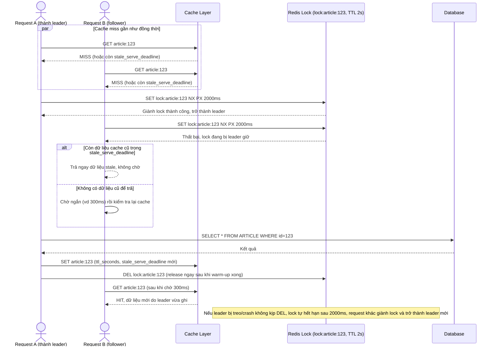

# Enhance sequence — Chỉ leader query DB, follower chờ ngắn hoặc trả stale data

Đây là **enhance** của flow `read-article-cache-miss` đã có ở base. So với base (mọi request tự query DB song song), enhance thêm distributed lock trên Redis theo từng cache key: chỉ request giành được lock (leader) mới query DB và warm-up cache, các request khác (follower) chờ ngắn hoặc trả ngay dữ liệu cũ nếu có. Đáp ứng yêu cầu 1 (chỉ leader query DB, follower chờ vài trăm ms hoặc dùng stale data, không tự query song song) và yêu cầu 2 (lock có TTL, tự hết hạn nếu leader bị treo/crash).

