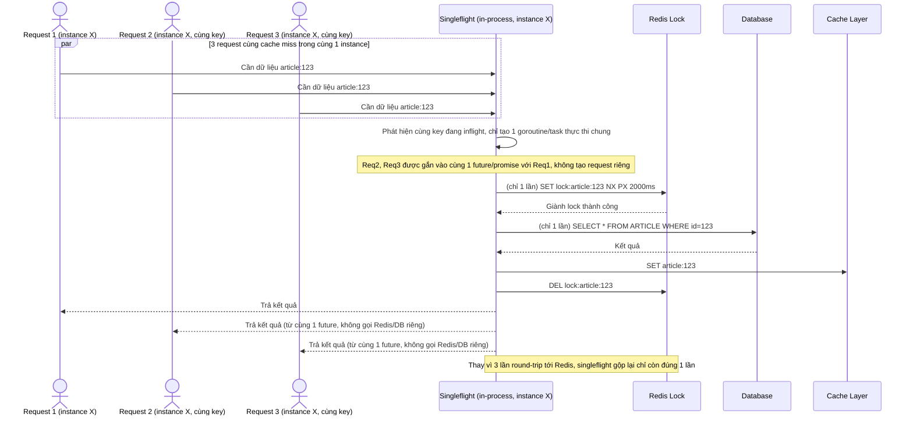

# Enhance sequence — Singleflight nội bộ instance kết hợp distributed lock

Đây là **enhance**, flow hoàn toàn mới mô tả tầng singleflight bên trong 1 instance, đứng trước distributed lock ở tầng giữa các instance. Đáp ứng yêu cầu 3: nhiều request đồng thời trong cùng 1 instance cho cùng cache key chỉ tạo ra đúng 1 lời gọi tới coordinator (Redis), giảm số round-trip không cần thiết tới Redis khi vốn dĩ chúng đã có thể gộp chung kết quả ngay trong process.

