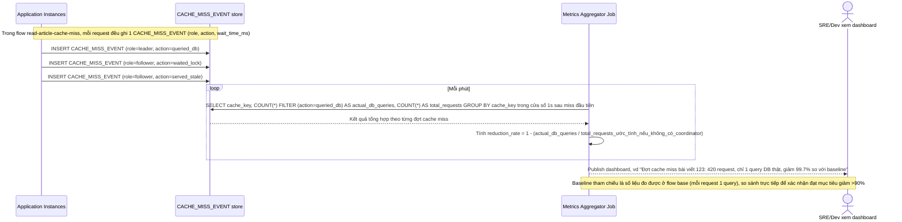

# Enhance sequence — Đo lường mức giảm DB query trùng lặp so với baseline

Đây là **enhance**, flow hoàn toàn mới mô tả cách hệ thống đo lường hiệu quả của coordinator sau khi triển khai. Đáp ứng yêu cầu 4: cần con số cụ thể chứng minh giảm được >90% query trùng lặp trong 1 giây đầu sau cache miss, dựa trên dữ liệu `CACHE_MISS_EVENT` được ghi lại ở flow acquire-lock.

