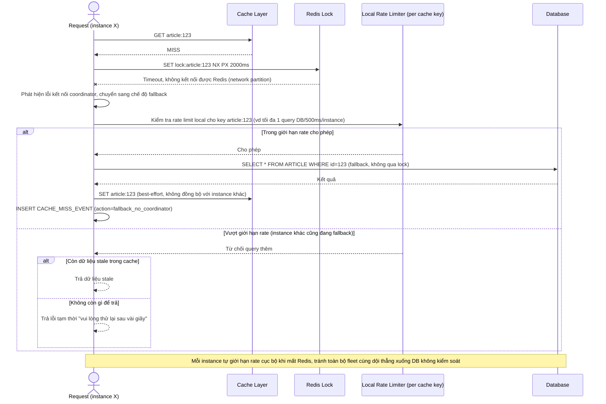

# Enhance sequence — Fallback khi instance mất kết nối tới Redis coordinator

Đây là **enhance**, flow hoàn toàn mới xử lý network partition giữa instance và Redis. Đáp ứng yêu cầu 5: khi không kết nối được coordinator, instance phải có fallback (tự query DB có giới hạn rate) thay vì treo chờ vô hạn hoặc từ chối toàn bộ request, tránh outage toàn phần.

