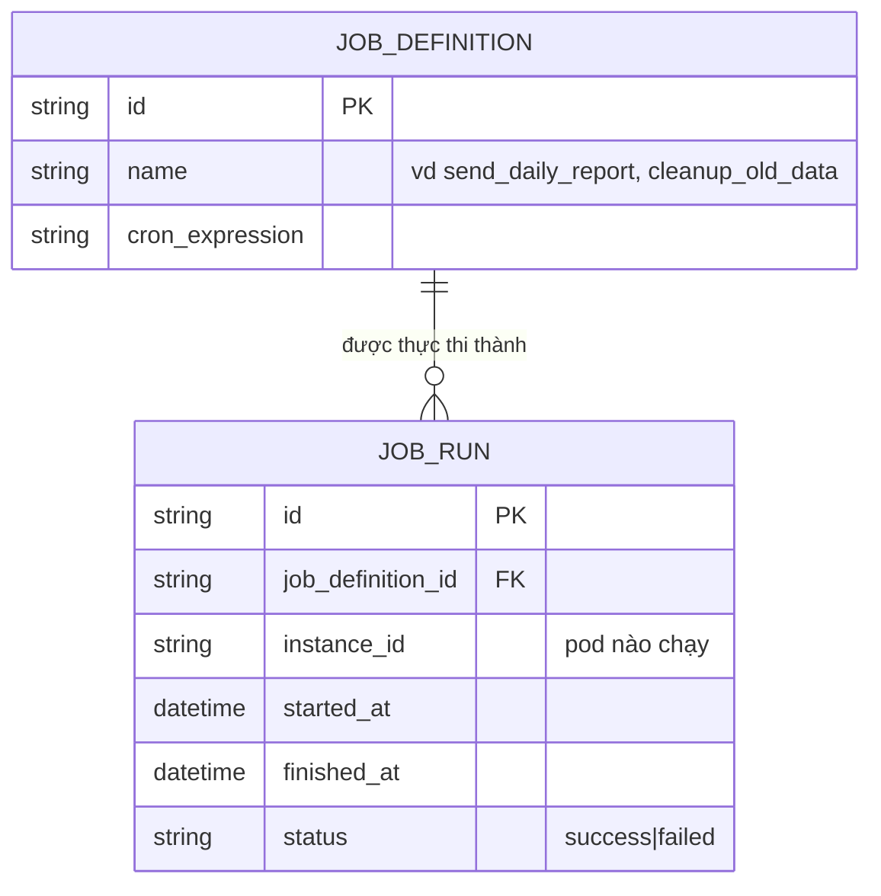

# Base ERD — Job định kỳ chạy độc lập trên từng instance, chưa có điều phối

Đây là **base**: trạng thái hệ thống *trước khi* có distributed lock. Suy luận từ đề bài, base đã có `JOB_DEFINITION` mô tả job định kỳ (tên, biểu thức cron/lịch chạy), và mỗi lần job được kích hoạt tạo 1 `JOB_RUN` ghi lại instance nào chạy, kết quả ra sao. Vì hệ thống được scale ra nhiều instance chạy cùng một lịch cron nội bộ, base chưa có cơ chế nào đảm bảo chỉ 1 instance thực thi — mỗi instance tự trigger job theo timer riêng của mình.

