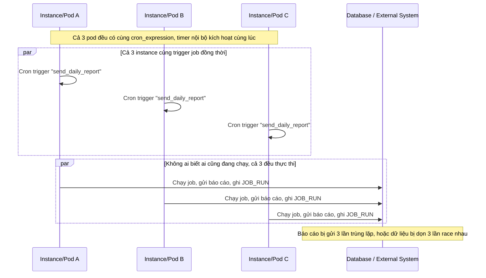

# Base sequence — Mỗi instance tự chạy job theo lịch riêng, chạy trùng lặp

Đây là **base**, flow chạy job định kỳ hiện tại: mỗi instance/pod có timer nội bộ riêng theo `cron_expression`, khi tới giờ thì tự chạy job mà không hỏi ý kiến ai. Đây chính là vấn đề nêu trong đề bài — service được scale ra nhiều instance để chịu tải, nhưng job như gửi báo cáo hay dọn dữ liệu lại vô tình chạy nhiều lần trùng lặp mỗi chu kỳ, có thể gây gửi báo cáo trùng hoặc dọn dữ liệu race nhau.

