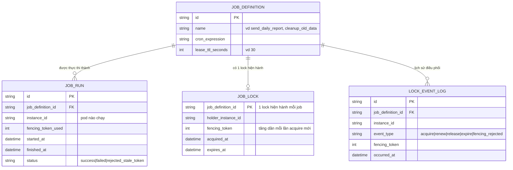

# Enhance ERD — Thêm lease-based lock, fencing token và log điều phối

Đây là ERD **sau khi** enhance được áp dụng lên base. So với base, có thêm 2 entity mới và `JOB_RUN` được bổ sung trường ràng buộc với lock, ứng trực tiếp với các yêu cầu:

- `JOB_LOCK` (mới) với `holder_instance_id`, `expires_at`, `fencing_token` — đáp ứng yêu cầu 1 (lock có TTL/lease rõ ràng, holder phải renew trước khi hết hạn) và yêu cầu 2 (nếu holder crash không renew kịp, lock tự hết hạn cho instance khác giành).
- `JOB_RUN.fencing_token` — đáp ứng yêu cầu 3 (job service phải kiểm tra fencing token khi ghi kết quả, từ chối ghi nếu token cũ đã bị vô hiệu do lock đã đổi chủ).
- `LOCK_EVENT_LOG` (mới) — đáp ứng yêu cầu 4 (log rõ instance nào giữ lock, thời điểm acquire/release/renew để debug) và là nguồn dữ liệu tính `failover_time_ms` cho yêu cầu 5 (SLA failover dưới ngưỡng, vd 10s).

