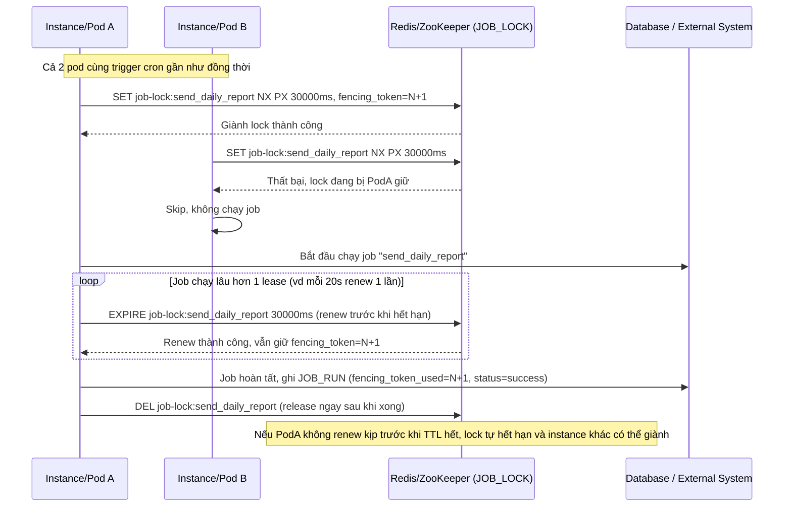

# Enhance sequence — Chỉ instance giữ lock mới chạy job, phải renew trước khi hết hạn

Đây là **enhance** của flow `run-scheduled-job` đã có ở base. So với base (mọi instance tự chạy job độc lập), enhance bắt buộc instance phải giành `JOB_LOCK` trước khi chạy, và phải renew (heartbeat) trước khi TTL hết nếu job chạy lâu hơn 1 lease. Đáp ứng yêu cầu 1: lock có TTL/lease rõ ràng, instance giữ lock phải renew trước khi TTL hết, nếu không renew kịp lock tự nhả cho instance khác.

