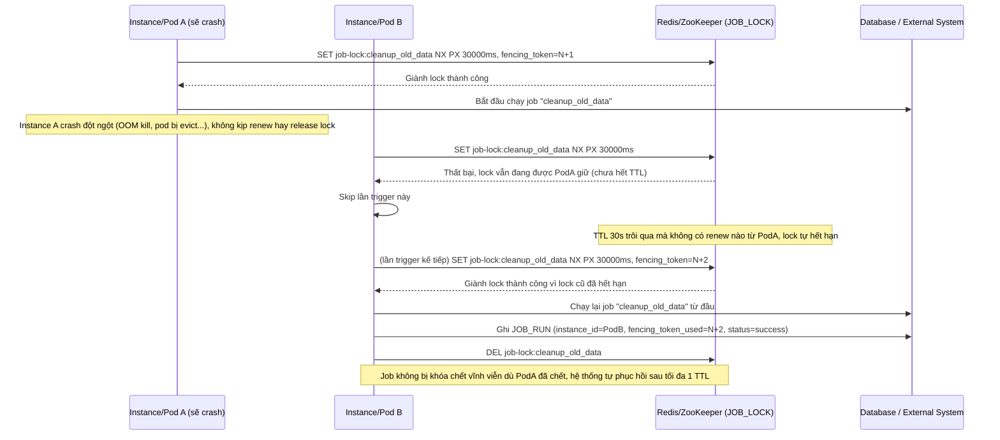

# Enhance sequence — Instance crash giữa job, lock tự hết hạn, instance khác chạy lại

Đây là **enhance**, flow hoàn toàn mới mô tả trường hợp instance giữ lock crash bất ngờ giữa lúc chạy job, không kịp release lock. Đáp ứng yêu cầu 2: lock phải tự hết hạn sau TTL và job có thể chạy lại bởi instance khác, không bị khóa chết vĩnh viễn dù có 1 instance chết đột ngột.

