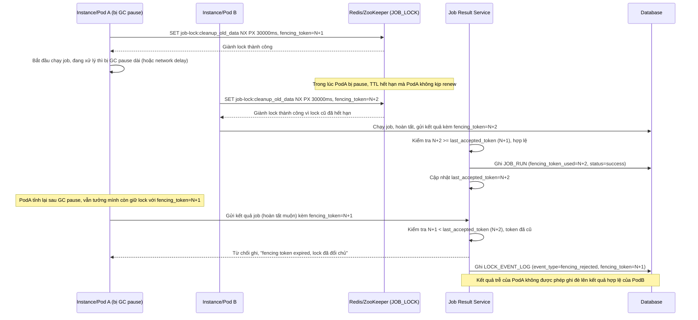

# Enhance sequence — Fencing token chặn instance cũ ghi kết quả sau khi mất lock

Đây là **enhance**, flow hoàn toàn mới xử lý trường hợp instance bị GC pause/network delay tưởng mình còn giữ lock. Đáp ứng yêu cầu 3: chống trường hợp instance cũ tiếp tục ghi dữ liệu sau khi lock đã hết hạn và bị instance khác giành mất, bằng cách so sánh fencing token trước khi cho phép ghi kết quả job.

