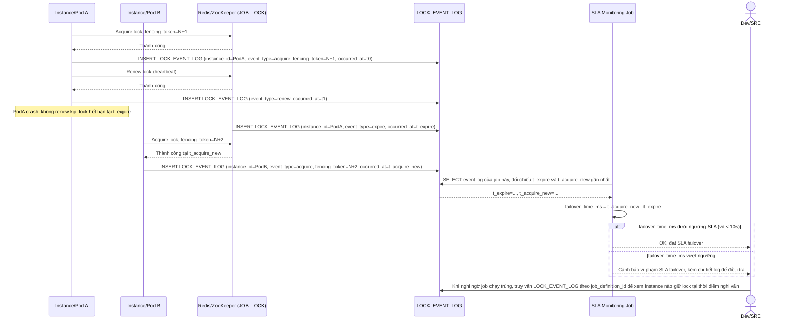

# Enhance sequence — Log điều phối lock và đo SLA failover time

Đây là **enhance**, flow hoàn toàn mới mô tả việc ghi log chi tiết mọi thao tác lock và tính toán chỉ số SLA từ log đó. Đáp ứng yêu cầu 4 (log rõ instance nào giữ lock, thời điểm acquire/release/renew để debug khi nghi ngờ job chạy trùng) và yêu cầu 5 (đo thời gian tối đa từ lúc lock cũ hết hạn tới lúc instance mới giành được lock mới phải dưới ngưỡng, vd 10s).

