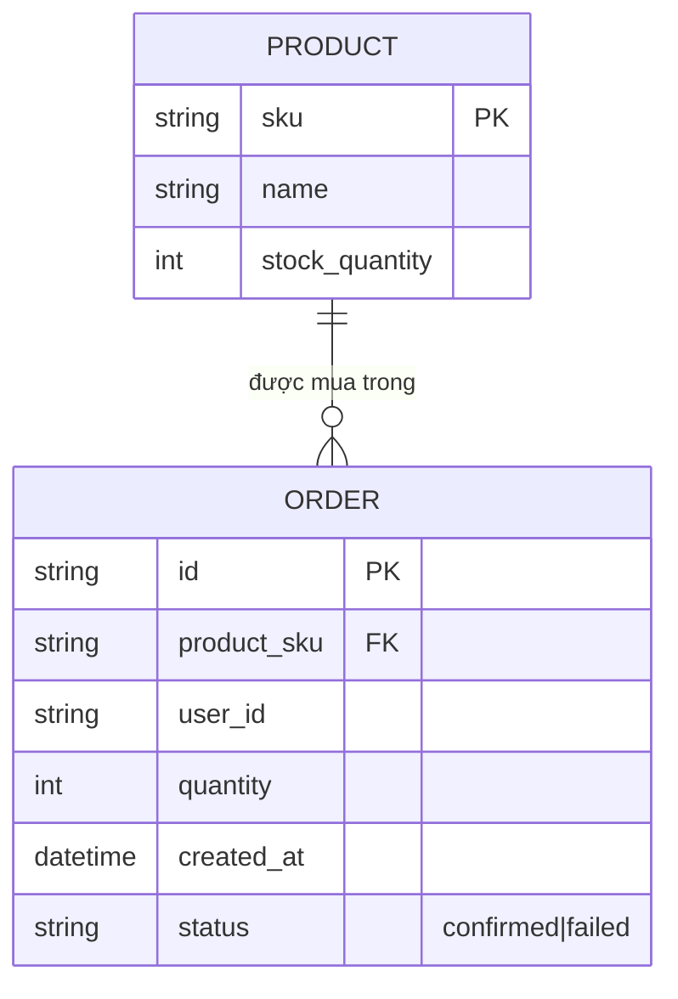

# Base ERD — Tồn kho và đơn hàng chưa có cơ chế khóa khi mua đồng thời

Đây là **base**: trạng thái sàn thương mại điện tử *trước khi* có distributed lock per-SKU. Suy luận từ đề bài, base đã có `PRODUCT` với `stock_quantity` đại diện số lượng tồn kho, và mỗi lần mua thành công tạo 1 `ORDER` tham chiếu tới product. Base xử lý mua hàng bằng đọc số tồn kho rồi trừ trực tiếp trong 1 transaction DB thông thường, không có khóa nào bảo vệ giữa lúc đọc và lúc trừ khi nhiều request cùng mua 1 sản phẩm.

