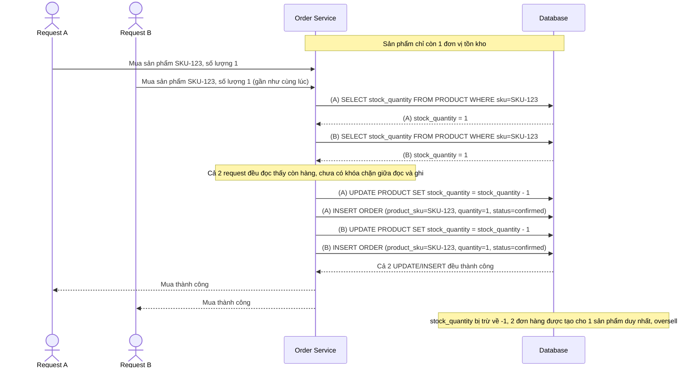

# Base sequence — Đọc-trừ tồn kho trực tiếp, oversell khi mua đồng thời

Đây là **base**, flow mua hàng hiện tại: server đọc `stock_quantity`, kiểm tra còn hàng rồi trừ đi trong 1 transaction DB thông thường, không có khóa nào bảo vệ khoảng giữa đọc và ghi. Đây chính là kịch bản oversell nêu trong đề bài — hàng nghìn request mua hàng gửi tới cùng lúc khi mở bán flash sale, nhiều request cùng đọc thấy còn hàng rồi cùng trừ.

