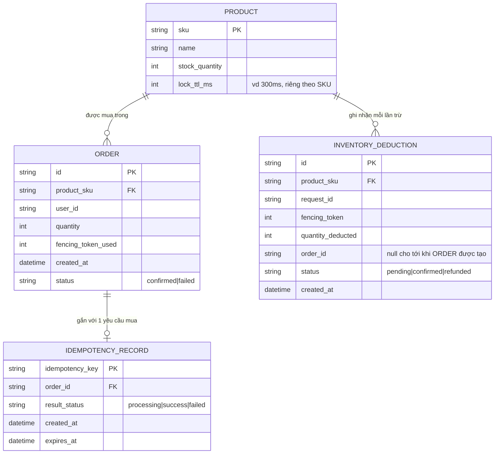

# Enhance ERD — Thêm idempotency, fencing token và log trừ kho để reconcile

Đây là ERD **sau khi** enhance được áp dụng lên base. `PRODUCT` giữ nguyên (khóa per-SKU trên Redis là coordination ephemeral, key dạng `lock:sku:{sku}`, không phải dữ liệu bền vững nên không xuất hiện là entity riêng). Có 2 entity mới và `ORDER` được bổ sung trường, ứng trực tiếp với các yêu cầu:

- `INVENTORY_DEDUCTION.fencing_token` và `ORDER.fencing_token_used` — đáp ứng yêu cầu 3 (fencing token gắn với lock, request dùng token cũ sau khi lock hết hạn bị từ chối ghi).
- `INVENTORY_DEDUCTION.status` (`pending`/`confirmed`/`refunded`) — đáp ứng yêu cầu 2 (khi lock hết hạn mà process crash giữa lúc đã trừ kho nhưng chưa tạo order, job reconcile phát hiện deduction còn `pending` không có order tương ứng để hoàn lại tồn kho).
- `IDEMPOTENCY_RECORD` (mới), độc lập với cơ chế lock — đáp ứng yêu cầu 5 (client retry do timeout network không được trừ kho 2 lần cho cùng 1 yêu cầu mua, dùng idempotency key gắn với request thay vì dựa vào lock).
- `PRODUCT.lock_ttl_ms` — đáp ứng yêu cầu 1 (TTL cấu hình theo từng SKU, đủ ngắn để nhả nhanh nhưng đủ dài để hoàn tất thao tác trừ kho).

