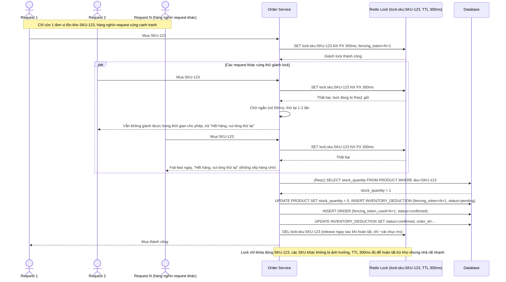

# Enhance sequence — Lock per-SKU với TTL hợp lý và fail-fast cho request thua cuộc

Đây là **enhance** của flow `purchase-flash-sale` đã có ở base. So với base (đọc-trừ trực tiếp không khóa), enhance thêm distributed lock theo đúng granularity per-SKU (không lock toàn catalog, không lock chung theo warehouse) với TTL ngắn vừa đủ, và fail-fast cho request không giành được lock trong thời gian ngắn. Đáp ứng yêu cầu 1 (granularity per-SKU, TTL đủ ngắn để nhả nhanh nhưng đủ dài để hoàn tất trừ kho) và yêu cầu 4 (fail-fast, không xếp hàng chờ vô hạn khi có hàng nghìn request cạnh tranh).

